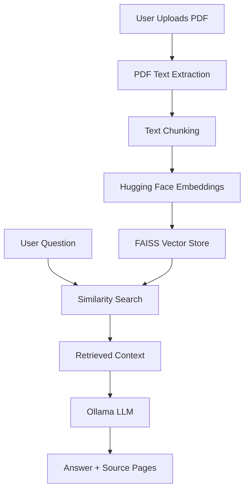

# 📄 GenAI Document Q&A Assistant

A modular **Retrieval-Augmented Generation (RAG)** application that allows users to upload PDF documents and ask questions about their content.

The application retrieves the most relevant sections from the uploaded document and uses a local Large Language Model (LLM) to generate a grounded answer with source page references.

---

## 🚀 Features

* 📄 Upload PDF documents
* 🔍 Extract text from PDF pages
* ✂️ Split documents into smaller chunks
* 🧠 Generate semantic embeddings using Hugging Face
* ⚡ Store and search embeddings using FAISS
* 🤖 Generate answers using a local Ollama LLM
* 📑 Display source pages used for the answer
* 🖥️ Simple Streamlit interface
* 🔐 Runs locally without requiring a paid LLM API

---

## 🏗️ Architecture



---

## 🔄 How It Works

The application follows a standard RAG pipeline:

### 1. Document Loading

The uploaded PDF is processed using **PyPDF**.

Text is extracted page by page while preserving the page number as metadata.

### 2. Text Chunking

Large documents are divided into smaller overlapping chunks using `RecursiveCharacterTextSplitter`.

Current configuration:

* Chunk size: 1000 characters
* Chunk overlap: 200 characters

Chunking allows the retrieval system to find smaller, relevant portions of the document instead of processing the entire PDF at once.

### 3. Embeddings

Each text chunk is converted into a numerical vector using:

`sentence-transformers/all-MiniLM-L6-v2`

These embeddings represent the semantic meaning of the text.

### 4. Vector Search

The embeddings are stored in a **FAISS** vector database.

When the user asks a question, the question is also converted into an embedding and compared with the document embeddings.

The most relevant chunks are retrieved using similarity search.

### 5. Context-Aware Generation

The retrieved chunks are passed to a local **Ollama** LLM along with the user's question.

The prompt instructs the model to answer using only the retrieved document context.

### 6. Source References

The application displays the page numbers associated with the retrieved chunks so users can trace the answer back to the document.

---

## 🛠️ Tech Stack

| Technology   | Purpose                  |
| ------------ | ------------------------ |
| Python       | Application development  |
| Streamlit    | User interface           |
| LangChain    | RAG pipeline components  |
| PyPDF        | PDF text extraction      |
| Hugging Face | Text embeddings          |
| FAISS        | Vector similarity search |
| Ollama       | Local LLM inference      |
| TinyLlama    | Local language model     |

---

## 📁 Project Structure

```text
GenAI_document_qa/
│
├── src/
│   ├── __init__.py
│   ├── document_loader.py
│   ├── text_splitter.py
│   ├── vector_store.py
│   └── qa_chain.py
│
├── data/
│   └── sample.pdf
│
├── test_loader.py
├── test_chunking.py
├── test_vector_store.py
├── test_retrieval.py
├── test_qa.py
│
├── app.py
├── requirements.txt
├── README.md
├── .gitignore
└── .env
```

---

## ⚙️ Setup

### 1. Clone the repository

```bash
git clone <your-repository-url>
cd GenAI_document_qa
```

### 2. Create a virtual environment

```bash
python -m venv venv
```

### 3. Activate the environment

**Windows PowerShell:**

```powershell
.\venv\Scripts\Activate.ps1
```

### 4. Install dependencies

```bash
pip install -r requirements.txt
```

### 5. Install Ollama

Install Ollama and download the model:

```bash
ollama pull tinyllama
```

Make sure Ollama is running before starting the application.

### 6. Run the application

```bash
streamlit run app.py --server.fileWatcherType none
```

The application will open in the browser.

---

## 💡 Example

Upload a research paper or technical PDF and ask questions such as:

> What are the three main components of Retrieval-Augmented Generation?

The system retrieves relevant document chunks, generates an answer using the local LLM, and displays the source pages.

---

## 🎯 Why RAG?

Traditional LLM applications rely primarily on knowledge learned during model training.

RAG adds an external knowledge retrieval step:

```text
User Question
      ↓
Retrieve Relevant Information
      ↓
Provide Retrieved Context to LLM
      ↓
Generate Grounded Answer
```

This makes the application suitable for question answering over private or domain-specific documents without requiring the entire document to be included in every prompt.

---

## ⚠️ Current Limitations

* Answer quality depends on the capabilities of the selected local LLM.
* The current prototype uses TinyLlama, which is lightweight but has limited reasoning capability.
* Retrieval currently uses a simple similarity search.
* Scanned PDFs requiring OCR are not currently supported.
* Vector stores are created during application execution rather than persisted between sessions.
* The current implementation is intended as a prototype rather than a production document platform.

---

## 🔮 Future Improvements

Potential improvements include:

* Replace TinyLlama with a stronger local or hosted LLM
* Add reranking for improved retrieval accuracy
* Add hybrid keyword + semantic search
* Persist vector databases
* Add OCR support for scanned documents
* Add document metadata filtering
* Add automated RAG evaluation
* Improve citation display with retrieved text snippets
* Add support for multiple documents

---

## 📌 Key Learning

This project demonstrates an end-to-end RAG workflow:

**PDF → Text Extraction → Chunking → Embeddings → FAISS → Retrieval → LLM → Answer + Sources**

It also separates document processing, vector search, and answer generation into independent modules, making the application easier to maintain and extend.
